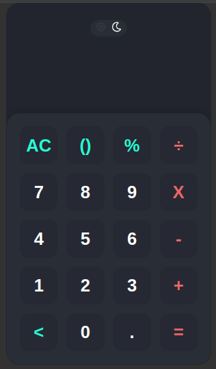
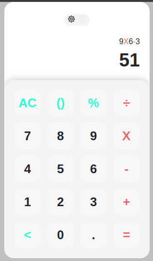

# Calculadora

<p align="center">
  

</p>

## 🧪 Tecnologias

Esse projeto foi desenvolvido com as seguintes tecnologias:

- [HTML](https://developer.mozilla.org/pt-BR/docs/Web/HTML)
- [CSS](https://developer.mozilla.org/pt-BR/docs/Web/CSS)
- [JavaScrpt](https://developer.mozilla.org/pt-BR/docs/Web/JavaScript)

## 🚀 Como executar

Clone o projeto e acesse a pasta do mesmo.

```bash
$ git clone https://github.com/EduardoPanzo/Calculadora.git
$ cd Calculadora
```

Para iniciá-lo, siga os passos abaixo:

```bash
# Iniciar o projeto
$ abrir na raiz o arquivo #index.html
```

O app estará disponível no seu browser

## 💻 Projeto

### O que Faz?

- Calculadora simples, resolvendo as operações aritmética

### Toda contribuiçao é bem-vinda ✔

### O código pode melhorar 💻

### Práticando os meus Conhecimento em JS 😊
